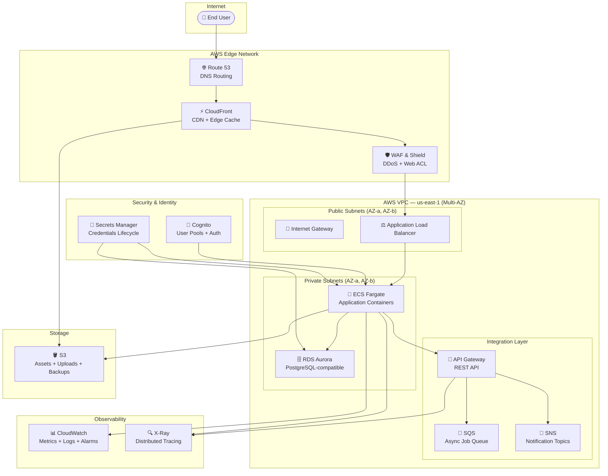

# AWS Public SaaS Platform — getmoney-saas
## Region: US-EAST-1 (North Virginia) | Environment: Development | Tier: PREMIUM

---

## 📋 Blueprint Overview

| Attribute | Value |
|-----------|-------|
| **Blueprint ID** | `tpl_a650615ea1c6` |
| **Workload Name** | `getmoney-saas` |
| **Provider** | AWS |
| **Region** | us-east-1 (North Virginia) |
| **Category** | Web Application / Public SaaS |
| **Environment** | Development |
| **Availability Target** | 99.9% |
| **Scalability Model** | Auto-scaling |
| **Cost Posture** | Balanced |
| **Compliance** | None |
| **Data Classification** | Public |
| **Disaster Recovery** | None (Single Region) |
| **Estimated Monthly Cost** | $350.00 – $600.00 USD |
| **Author** | CloudGods.io |
| **Tier** | PREMIUM |

---

## 🏗️ Architecture Narrative

The `getmoney-saas` blueprint provisions a cloud-native, auto-scaling AWS SaaS platform designed for public-facing workloads in the US-EAST-1 (North Virginia) region. It follows the AWS Well-Architected Framework across five pillars: operational excellence, security, reliability, performance efficiency, and cost optimization.

The architecture is structured in distinct layers — networking and delivery, compute, data, security, observability, and integration — each independently scalable and loosely coupled to support rapid feature development and resilient operations at SaaS scale.

Traffic enters via **Route 53** for DNS resolution and is distributed globally through **CloudFront**, providing edge caching and DDoS protection before requests reach the application tier. **AWS WAF & Shield** is applied at the CloudFront layer to protect against common web exploits such as SQL injection and cross-site scripting.

Authenticated users interact with the platform through **Amazon Cognito**, which handles sign-up, sign-in, MFA, and JWT token issuance. API traffic is managed by **API Gateway**, which routes requests to backend **ECS Fargate** services running containerized application logic. Fargate eliminates the need to manage EC2 instances while providing fine-grained auto-scaling based on CPU and memory metrics.

Persistent application data is stored in **RDS Aurora (PostgreSQL-compatible)**, which delivers up to 5x the throughput of standard PostgreSQL with automatic storage scaling and built-in multi-AZ replication. Static assets, user uploads, and application backups are stored in **Amazon S3**, with CloudFront serving as the CDN for asset delivery.

Sensitive configuration, database credentials, and API keys are lifecycle-managed by **AWS Secrets Manager**, eliminating hardcoded secrets. All infrastructure activity is observable through **CloudWatch** (metrics, logs, alarms) and **AWS X-Ray** (distributed tracing across ECS and API Gateway). Async workloads — such as email delivery, billing events, and webhook fan-out — are handled by **SQS** (queue-based decoupling) and **SNS** (multi-subscriber notification topics).

---

## 🗺️ Architecture Diagram (Mermaid)



---

## 🧱 Service Architecture by Layer

### Layer 1: Networking & Delivery

#### AWS VPC
- **Purpose**: Isolated virtual network providing the foundational network boundary for all compute and data resources
- **Configuration**: Multi-AZ deployment across at least 2 Availability Zones (AZ-a, AZ-b) in us-east-1
- **Subnets**: Public subnets for load balancers and NAT Gateways; private subnets for ECS tasks and RDS Aurora
- **NAT Gateways**: 2 (one per AZ) enabling private subnet egress to the internet without public exposure
- **Security Groups**: Layered security groups enforcing least-privilege inbound/outbound rules per service tier

#### AWS CloudFront
- **Purpose**: Global CDN reducing latency for end users worldwide by caching static and dynamic content at edge locations
- **Origin**: ALB for dynamic API traffic; S3 for static asset delivery
- **Features**: HTTPS enforcement, custom cache behaviors, origin failover, geo-restriction support
- **Integration**: WAF Web ACL attached at the CloudFront distribution for edge-layer protection

#### AWS Route 53
- **Purpose**: Authoritative DNS service for the `getmoney-saas` domain
- **Routing Policy**: Simple or latency-based routing pointing to the CloudFront distribution
- **Health Checks**: Optional endpoint health checks for failover routing

---

### Layer 2: Compute

#### AWS ECS (Fargate)
- **Purpose**: Serverless container orchestration for running application workloads without managing EC2 instances
- **Launch Type**: Fargate — no cluster node provisioning, patching, or scaling required
- **Task Definitions**: CPU and memory allocated per container workload; environment variables injected via Secrets Manager
- **Auto-scaling**: Application Auto Scaling based on CPU utilization, memory utilization, and ALB request count metrics
- **Networking**: Tasks run in private subnets; communicate with RDS Aurora and S3 via VPC endpoints or NAT Gateway
- **Service Discovery**: Optional AWS Cloud Map integration for inter-service communication

---

### Layer 3: Data Storage

#### AWS RDS Aurora (PostgreSQL-compatible)
- **Purpose**: Primary relational database for all SaaS application data — user records, subscriptions, transactions
- **Engine**: Aurora PostgreSQL — up to 5x throughput over standard PostgreSQL with shared storage architecture
- **Storage**: Auto-scaling distributed storage (10 GB increments, up to 128 TB)
- **Replication**: Aurora maintains 6 copies of data across 3 AZs automatically
- **Backups**: Automated backups with configurable retention (default: 7 days); point-in-time recovery enabled
- **Endpoints**: Separate reader and writer endpoints for read/write splitting

#### AWS S3
- **Purpose**: Object storage for static web assets, user-generated content, application logs, and database backups
- **Buckets**:
  - `getmoney-saas-assets-dev` — Static frontend assets served via CloudFront
  - `getmoney-saas-uploads-dev` — User-generated file uploads (profile images, documents)
- **Security**: Bucket policies enforcing private access; CloudFront OAC (Origin Access Control) for asset bucket
- **Lifecycle**: Optional lifecycle policies for transitioning infrequently accessed objects to S3 Glacier

---

### Layer 4: Security, Identity & Access

#### AWS WAF & Shield
- **Purpose**: Edge-layer protection against web application attacks and volumetric DDoS
- **Web ACL Rules**: AWS Managed Rules (Core Rule Set, Known Bad Inputs); rate-based rules per IP
- **Shield**: Standard (included) — protects against layer 3/4 DDoS attacks
- **Attachment**: WAF Web ACL attached to CloudFront distribution

#### AWS Cognito
- **Purpose**: Managed user identity and authentication service for the SaaS platform
- **Features**: User pools with email/password and social login (Google, GitHub); MFA (TOTP/SMS); JWT token issuance
- **Integration**: API Gateway authorizer validates Cognito JWT tokens on protected routes
- **Hosted UI**: Optional Cognito Hosted UI for rapid auth flow implementation

#### AWS Secrets Manager
- **Purpose**: Centralized secrets lifecycle management — eliminates hardcoded credentials
- **Secrets Managed**:
  - RDS Aurora master credentials (auto-rotated)
  - Third-party API keys (payment providers, email services)
  - Application signing keys
- **Integration**: ECS task IAM roles granted `secretsmanager:GetSecretValue` on specific secret ARNs

---

### Layer 5: Monitoring & Observability

#### AWS CloudWatch
- **Purpose**: Full-stack metrics, log aggregation, and operational alarms
- **Log Groups**:
  - `/ecs/getmoney-saas-app` — Application container logs
  - `/aws/apigateway/getmoney-saas` — API Gateway access logs
  - `/rds/aurora/getmoney-saas` — Aurora slow query logs
- **Alarms**: CPU > 80%, memory > 85%, 5xx error rate > 1%, Aurora connection count thresholds
- **Dashboards**: Service health dashboard tracking request rates, error rates, latency, and DB performance
- **Auto-scaling Triggers**: CloudWatch alarms trigger ECS Application Auto Scaling policies

#### AWS X-Ray
- **Purpose**: Distributed tracing across ECS containers and API Gateway for latency analysis and debugging
- **Integration**: X-Ray SDK embedded in application containers; API Gateway X-Ray tracing enabled
- **Service Map**: Visual service dependency map showing latency and error rates between components
- **Sampling**: Default sampling rules (5% + 1 req/sec reservoir); configurable per route

---

### Layer 6: Integration & Messaging

#### AWS API Gateway
- **Purpose**: Managed API layer exposing REST endpoints to frontend clients and third-party integrations
- **Type**: HTTP API (lower latency, lower cost vs REST API) or REST API (full feature set)
- **Authorization**: Cognito JWT authorizer on protected routes; API keys for third-party integrations
- **Throttling**: Default burst limit 5,000 RPS; configurable per stage and route
- **Integration**: Lambda proxy or VPC Link to ECS ALB for backend routing

#### AWS SQS
- **Purpose**: Decoupled async message queue for background job processing
- **Queues**:
  - `getmoney-saas-jobs-dev` — Standard queue for background tasks (email, reports, data processing)
  - `getmoney-saas-jobs-dlq-dev` — Dead letter queue for failed message handling
- **Consumer**: ECS Fargate tasks or Lambda functions polling for messages
- **Visibility Timeout**: Configured per job type to prevent duplicate processing

#### AWS SNS
- **Purpose**: Fan-out notification service for multi-subscriber event distribution
- **Topics**:
  - `getmoney-saas-events-dev` — Application events (user signup, payment success) fanning out to SQS, email, webhooks
  - `getmoney-saas-alerts-dev` — Operational alerts fan-out to CloudWatch and on-call systems
- **Subscriptions**: SQS queues, Lambda functions, HTTPS endpoints (webhooks)

---

## 💰 Cost Estimate

| Service | Estimated Monthly Cost |
|---------|----------------------|
| ECS Fargate (2 tasks, 1 vCPU / 2 GB) | ~$60–$90 |
| RDS Aurora PostgreSQL (db.t3.medium) | ~$80–$120 |
| CloudFront (100 GB transfer/month) | ~$20–$40 |
| API Gateway (1M requests/month) | ~$10–$20 |
| S3 (50 GB storage + transfers) | ~$10–$15 |
| NAT Gateways (2x) | ~$65–$80 |
| WAF (1 Web ACL + rules) | ~$15–$25 |
| Cognito (10K MAU) | ~$0–$5 |
| Secrets Manager (3 secrets) | ~$2–$5 |
| CloudWatch + X-Ray | ~$20–$40 |
| SQS + SNS | ~$5–$10 |
| Route 53 | ~$5–$10 |
| **Total Estimate** | **$292–$460 USD/month** |

> ⚠️ Costs scale with traffic, storage growth, and additional ECS task replicas. Use AWS Cost Explorer and set billing alarms in CloudWatch for ongoing cost governance.

---

## 🔐 Security Architecture

### Defense in Depth Model

```
[Internet]
    │
    ▼
[Route 53] — DNS-level protection (DNSSEC optional)
    │
    ▼
[CloudFront + WAF] — Edge DDoS + Web ACL (SQLi, XSS, rate limiting)
    │
    ▼
[ALB] — HTTPS termination, security group restricts to CloudFront IPs only
    │
    ▼
[ECS Fargate] — Private subnet, IAM task roles, no SSH access
    │
    ▼
[RDS Aurora] — Private subnet, security group allows ECS SG only, encrypted at rest
```

### IAM Least Privilege
- ECS task roles scoped to specific S3 buckets, Secrets Manager ARNs, and SQS queues
- No wildcard `*` actions or resources in production task policies
- Cognito user pool with fine-grained app client scopes

### Encryption
- **In transit**: TLS 1.2+ enforced on CloudFront, ALB, and API Gateway; RDS SSL required
- **At rest**: S3 SSE-S3 (or SSE-KMS); RDS Aurora encrypted with AWS-managed key; Secrets Manager encrypted by default

---

## ⚠️ Known Tradeoffs & Anti-Patterns

| Decision | Tradeoff | Mitigation |
|----------|----------|------------|
| No DR strategy | Single-region failure risk | Enable RDS automated backups; consider S3 cross-region replication for critical assets |
| ECS over EKS | Less Kubernetes flexibility | Suitable for current scale; migrate to EKS if microservices complexity grows significantly |
| Aurora PostgreSQL over DynamoDB | Higher cost at low scale | Aurora provides relational consistency critical for SaaS billing and user data |
| No ElastiCache | Increased DB read load at scale | Add ElastiCache Redis when Aurora read replica becomes a bottleneck |
| WAF Standard rules only | May miss custom attack patterns | Add custom WAF rules based on observed traffic patterns over time |
| No CloudTrail | Limited audit log | Add CloudTrail for compliance and security incident investigation as the platform matures |

---

## 🚀 Deployment Checklist

### Pre-Deployment
- [ ] Configure AWS CLI with deployment credentials
- [ ] Set GitHub PAT in CloudGods for Terraform module access
- [ ] Register domain in Route 53 or update NS records
- [ ] Request ACM certificate for your domain (us-east-1 for CloudFront)

### Infrastructure Deployment Order
1. **VPC** — Network foundation (subnets, route tables, NAT Gateways, IGW)
2. **S3** — Storage buckets with policies
3. **RDS Aurora** — Database cluster in private subnets
4. **Secrets Manager** — Store DB credentials and API keys
5. **Cognito** — User pool and app client configuration
6. **ECS** — Cluster, task definitions, and Fargate services
7. **API Gateway** — HTTP API with Cognito authorizer
8. **SQS + SNS** — Queues and topics with subscriptions
9. **CloudFront + WAF** — Distribution with WAF Web ACL attached
10. **Route 53** — DNS records pointing to CloudFront
11. **CloudWatch + X-Ray** — Log groups, alarms, dashboards

### Post-Deployment
- [ ] Verify CloudFront → ALB → ECS request flow end-to-end
- [ ] Test Cognito sign-up and token validation on API Gateway
- [ ] Confirm RDS Aurora connectivity from ECS tasks
- [ ] Set CloudWatch billing alarm at $400/month threshold
- [ ] Enable AWS Config for resource configuration tracking

---

## 📈 Scaling Guidance

### ECS Auto-Scaling Policy (Recommended)
- Scale out when CPU > 70% for 2 consecutive minutes
- Scale in when CPU < 30% for 10 consecutive minutes
- Minimum tasks: 2 (for 99.9% availability across AZs)
- Maximum tasks: 20 (adjust based on Aurora connection limits)

### Aurora Read Scaling
- Add Aurora read replicas when write instance CPU > 60%
- Configure application to route SELECT queries to reader endpoint
- Consider Aurora Serverless v2 for highly variable workloads

### Future Architecture Additions (as platform grows)
- **ElastiCache Redis** — Session caching, rate limiting, leaderboard features
- **CloudTrail** — Audit logging for compliance and security investigation
- **AWS Shield Advanced** — Enhanced DDoS response for high-revenue SaaS
- **AWS Config** — Continuous compliance monitoring
- **Multi-region active-passive DR** — When uptime SLA demands 99.99%

---

## 📚 References

- [AWS Well-Architected Framework](https://aws.amazon.com/architecture/well-architected/)
- [ECS Fargate Best Practices](https://docs.aws.amazon.com/AmazonECS/latest/bestpracticesguide/index.html)
- [Aurora PostgreSQL Documentation](https://docs.aws.amazon.com/AmazonRDS/latest/AuroraUserGuide/Aurora.AuroraPostgreSQL.html)
- [CloudFront + WAF Integration](https://docs.aws.amazon.com/waf/latest/developerguide/cloudfront-features.html)
- [Cognito User Pools](https://docs.aws.amazon.com/cognito/latest/developerguide/cognito-user-identity-pools.html)
- [API Gateway HTTP APIs](https://docs.aws.amazon.com/apigateway/latest/developerguide/http-api.html)

---

*Generated by CloudGods.io Blueprint Engine | Blueprint ID: `tpl_a650615ea1c6` | June 2026*

